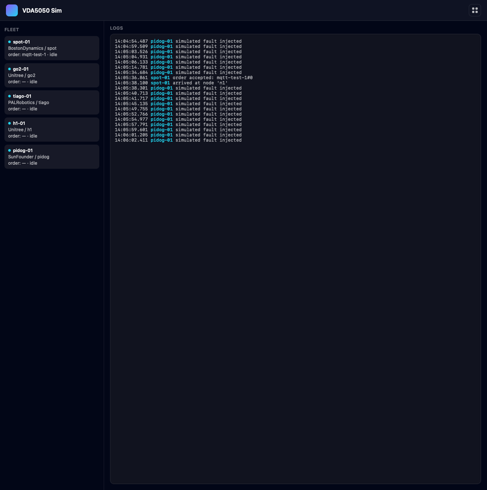

# vda5050-sim

A standards-compliant [VDA5050](https://github.com/VDA5050/VDA5050) (v3.0.0) robot fleet simulator. It fakes a configurable fleet of AGVs — by default 5 real robot archetypes (Boston Dynamics Spot, Unitree Go2, PAL Robotics TIAGo, Unitree H1, SunFounder PiDog) — that speak the real order/instant-action/state protocol, so you can point any VDA5050 fleet manager at it and watch it drive a graph, reject conflicting orders, cancel, pause, etc., without needing real hardware.

Unlike a quick reference simulator, this implements the actual order/instant-action validation rules from the spec — idle-gate on new orders, `orderUpdateId` accept/reject/ignore semantics, `cancelOrder`, pause, `blockingType` handling — verified by a conformance test suite, not a shallow approximation.



## Two ways to run it

**1. Standalone — plain VDA5050-over-MQTT (recommended default).**
This is the real VDA5050 wire protocol, so it works with any standard fleet manager / master control, no other infrastructure required:

```bash
docker build -t vda5050-sim .
docker run -p 8000:8000 \
  -e TRANSPORT=mqtt \
  -e MQTT_HOST=your-broker-host \
  -e MQTT_PORT=1883 \
  vda5050-sim
```

Robots publish/subscribe on the standard topic layout `vda5050/v3/{manufacturer}/{serialNumber}/{topic}` (`order`, `instantActions`, `state`, `visualization`, `connection`, `factsheet`) against whatever MQTT broker you point it at (Mosquitto, EMQX, HiveMQ, your fleet manager's own embedded broker, etc.). The log-viewer UI is at `http://localhost:8000/`.

**2. Over NATS.**
Set `TRANSPORT=nats` (and `NATS_BROKER=nats://...`) if your own stack already runs on a NATS message bus instead of MQTT — the same order/state/instant-action logic runs either way, just on `vda5050.v3.{manufacturer}.{serialNumber}.{topic}` subjects instead of MQTT topics.

## Connecting a real fleet manager

Any VDA5050-conformant fleet manager can drive this simulator directly. A few real, connectable options if you don't have your own:

- **[openTCS](https://github.com/openTCS/opentcs)** (Fraunhofer IML) — the most complete open-source fleet management system with a real VDA5050 integration via its [`opentcs-commadapter-vda5050`](https://github.com/openTCS/opentcs-commadapter-vda5050) plugin. Point its comm adapter at the same MQTT broker and it'll drive these robots like real AGVs.
- **[NVIDIA Isaac Mission Dispatch](https://github.com/nvidia-isaac/isaac_mission_dispatch)** — a maintained, VDA5050-compatible mission-dispatch service if you want something closer to production-grade fleet-manager behavior than a toy.
- **[vda-5050-lib.js](https://github.com/coatyio/vda-5050-lib.js)** — if you'd rather script your own master control quickly (TypeScript/Node, ships a `MasterController` class and JSON-schema-validated messages).

## Architecture and Runtime

- FastAPI service (Python 3.11, `uv`), one `SimulatedAgv` state machine + async pub/sub task set per configured robot (`src/vda5050_sim/agv.py`, `fleet.py`).
- A `Transport` abstraction (`src/vda5050_sim/transport.py`) is the only thing that differs between the two modes: `NatsTransport` (dot-separated subjects, core NATS pub/sub, no retained/replay — so `connection`/`state`/`visualization` are heartbeated continuously) and `MqttTransport` (slash-separated topics over real MQTT via `aiomqtt`). The `SimulatedAgv`/`Fleet` logic is identical either way.
- Wire schemas, error constants, topic conventions, and robot-spec/factsheet data are reused from the public [`nova-vda5050`](https://github.com/wandelbotsgmbh/nova-vda5050) package rather than hand-rolled.

## API Surface

- **MQTT** (subscribe, per robot): `vda5050/v3/{manufacturer}/{serial}/order`, `.../instantActions`. (publish): `.../state`, `.../visualization`, `.../connection`, `.../factsheet`.
- **NATS** (subscribe, per robot): `vda5050.v3.{manufacturer}.{serial}.order`, `...instantActions`. (publish): `...state`, `...visualization`, `...connection`, `...factsheet`.
- **REST**: `GET /health` (liveness), `GET /fleet` (JSON snapshot of every robot's live state), `GET /logs?n=200` (recent structured event log), `GET /` (log-viewer UI).

## Configuration

| Env var | Default | Purpose |
|---|---|---|
| `TRANSPORT` | `nats` | `mqtt` (standalone) or `nats` |
| `MQTT_HOST` | `localhost` | MQTT broker host (transport=mqtt) |
| `MQTT_PORT` | `1883` | MQTT broker port |
| `MQTT_USERNAME` / `MQTT_PASSWORD` | unset | MQTT auth, if the broker requires it |
| `MQTT_TLS` | `false` | Enable TLS to the MQTT broker |
| `MQTT_TOPIC_PREFIX` | `vda5050/v3` | MQTT topic prefix |
| `NATS_BROKER` (or `NATS_URL`) | `nats://localhost:4222` | NATS server (transport=nats) |
| `VDA5050_PREFIX` | `vda5050.v3` | NATS subject prefix |
| `FLEET_CONFIG_PATH` | `fleet.default.yaml` | Robot roster (see file for schema) |
| `STATE_HZ` | `1.0` | `state` publish rate |
| `VISUALIZATION_HZ` | `2.0` | `visualization` publish rate |
| `CONNECTION_HEARTBEAT_S` | `2.0` | `connection` heartbeat interval |
| `TICK_S` | `0.2` | Movement/order-processing tick |
| `ACTION_DURATION_S` | `1.0` | Simulated duration of a node/edge action |
| `PORT` | `8000` | HTTP port |

## Local Development

```bash
uv sync --extra dev

# Standalone/MQTT:
mosquitto &
TRANSPORT=mqtt uv run uvicorn vda5050_sim.main:app --reload --port 8000

# NATS:
nats-server &
uv run uvicorn vda5050_sim.main:app --reload --port 8000

uv run pytest      # conformance suite (spins up its own nats-server)
uv run ruff check
```

## Troubleshooting

- **A fleet manager can't see the robots over MQTT**: confirm `TRANSPORT=mqtt` and that both sides point at the same broker/`MQTT_TOPIC_PREFIX`; `mosquitto_sub -t 'vda5050/v3/#' -v` is the fastest way to check traffic is flowing at all.
- **`uv sync` fails to resolve `nova-vda5050`**: it's a git dependency (`github.com/wandelbotsgmbh/nova-vda5050`, public, no auth needed) — check network access to GitHub, not credentials.

## Related

- [VDA5050 specification](https://github.com/VDA5050/VDA5050)
- [`nova-vda5050`](https://github.com/wandelbotsgmbh/nova-vda5050) (schemas/errors/robot-specs this service depends on)
